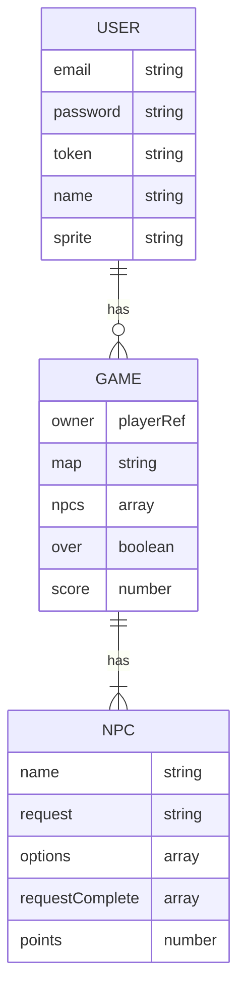

# Switching SEIdes

Heyoooo! Not sure where to ask or if I should post an issue request since it's not necessarily a project question but I am in need of a bit of React advice.

OK! So...updating state is asynchronous? What's the best way to handle axios requests and updating state synchronously without making a mess? Should I use a callback function or promises and async/await or maybe a hook? Should I even be using state? Am I making this way more complicated than it needs to be?
I can figure out how to write it, I'm just not sure which direction I should be looking in.
Sorry if this is super vague or word vomit-y, I think I fried several brain cells...

I'm trying to make a game turn loop that will
- make a get request for an npc
- set the state of 'currentNpc' with the npc object from the server
- display the currentnpc's request and options

then after the user clicks an option,
- display the corresponding npc reply
- update the currentNpc's 'requestComplete' value
- send patch request for the npc
- update the game state's score
- send patch request for game

Next turn:
- increase turn count
- load next npc id in array
- make get request
- now we're back at the beginning!

## Description

## Links
[Deployed Client](https://amaliaroye.github.io/seides-client/)
[Server Repo](https://github.com/amaliaroye/seides-server)
[Deployed Server]()

[Capsone Project](https://git.generalassemb.ly/ga-wdi-boston/capstone-project)

 
### Routes
Front-end routes - handled by React-Router

| Endpoint           | Component        | `AuthenticatedRoute` |
|--------------------|------------------|----------------------|
| `/games`           | `GamesIndex`     | Yes |
| `/games/:id`       | `GamesShow`      | Yes |

#### 🔒 Authentication Routes
| Endpoint           | Component        | `AuthenticatedRoute` |
|--------------------|------------------|----------------------|
| `/sign-up`         | `SignUp`         | No  |
| `/sign-in`         | `SignIn`         | No  |
| `/change-password` | `ChangePassword` | Yes |
| `/sign-out`        | `SignOut`        | Yes |

## 🙎 User Stories: v1
##### 🔒 AUTHENTICATION
  - A new user can sign-up with an email and password,
  - A returning user can sign-in with their email and password
  - A signed in user can choose to sign-out
  - A signed in user can change their user password

##### 🌍 MAP
  - A user can start a new game to display a map with entities displayed

##### 📦 ENTITIES
  - A user can click an entitity to create a new interaction and display one of the entities' random messages
  - A user can view all the interactions they've had in their diary

## 🙋 User Stories: v2
##### 📦 ENTITIES
 - Entities can be either an item or an npc.
 - Items are removed from the map and stored in the player's inventory. They still create an interaction event in the diary?
 - NPCs are not removed from the map and the interaction is stored in the diary

## Entity Relationship Diagram

