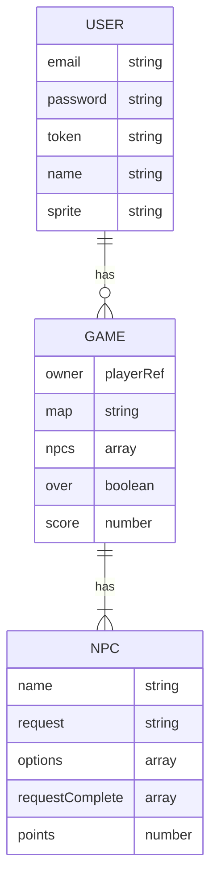

# Switching SEIdes

## Description

## Links
[Capsone Project](https://git.generalassemb.ly/ga-wdi-boston/capstone-project)
📋 [Requirements](https://git.generalassemb.ly/ga-wdi-boston/capstone-project/blob/main/requirements.md)
📅 [Recommended Schedule](https://git.generalassemb.ly/ga-wdi-boston/capstone-project/blob/main/schedule.md)

[Konva](https://konvajs.org/docs/)
[React Konva](https://github.com/konvajs/react-konva)

## Misc. Links
 [NES.css](https://nostalgic-css.github.io/NES.css/) + [RPG UI](https://github.com/RonenNess/RPGUI)
 [SASS Interpolation](https://sass-lang.com/documentation/interpolation)
 [Questbook](https://github.com/Leopotam/questbook)  + [Questbook JS](https://github.com/Leopotam/questbook-js)
 [RPG Language](http://howtomakeanrpg.com/a/rpg-dialog-language-discourse.html)
 
 
### Routes
Front-end routes - handled by React and React-Router

| Endpoint           | Component        | `AuthenticatedRoute` |
|--------------------|------------------|----------------------|
| `/games`           | `GamesIndex`     | Yes |
| `/games/:id`       | `GamesShow`      | Yes |

#### 🔒 Authentication Routes
| Endpoint           | Component        | `AuthenticatedRoute` |
|--------------------|------------------|----------------------|
| `/sign-up`         | `SignUp`         | No  |
| `/sign-in`         | `SignIn`         | No  |
| `/change-password` | `ChangePassword` | Yes |
| `/sign-out`        | `SignOut`        | Yes |

## 🙎 User Stories: v1
##### 🔒 AUTHENTICATION
  - A new user can sign-up with an email and password,
  - A returning user can sign-in with their email and password
  - A signed in user can choose to sign-out
  - A signed in user can change their user password

##### 🌍 MAP
  - A user can start a new game to display a map with entities displayed

##### 📦 ENTITIES
  - A user can click an entitity to create a new interaction and display one of the entities' random messages
  - A user can view all the interactions they've had in their diary

## 🙋 User Stories: v2
##### 📦 ENTITIES
 - Entities can be either an item or an npc.
 - Items are removed from the map and stored in the player's inventory. They still create an interaction event in the diary?
 - NPCs are not removed from the map and the interaction is stored in the diary

## Entity Relationship Diagram

