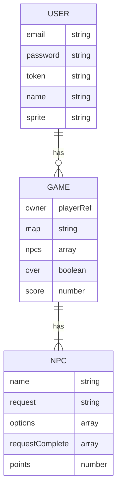

# Switching SEIdes
Switching SEIdes is a text-based rpg created in React.

## Links
[Deployed Client](https://amaliaroye.github.io/seides-client/)

[Server Repo](https://github.com/amaliaroye/seides-server)
[Deployed Server]()

[Capsone Project](https://git.generalassemb.ly/ga-wdi-boston/capstone-project)

## Screenshots

## Technologies
  - React 17.0

## Routes
##### 🎮 Game Routes
| Endpoint           | Component        | `AuthenticatedRoute` |
|--------------------|------------------|----------------------|
| `/games`           | `GameIndex`      | Yes |
| `/games/:id`       | `GamePlay`       | Yes |

##### 🔒 Authentication Routes
| Endpoint           | Component        | `AuthenticatedRoute` |
|--------------------|------------------|----------------------|
| `/sign-up`         | `SignUp`         | No  |
| `/sign-in`         | `SignIn`         | No  |
| `/change-password` | `ChangePassword` | Yes |
| `/sign-out`        | `SignOut`        | Yes |

## 🙎 User Stories
##### 🔒 Authentication
  - A new user can sign-up with an email and password
  - A returning user can sign-in with their email and password
  - A signed in user can sign-out of their account
  - A signed in user can change their password
##### 🎮 Gameplay
  - A signed in user can create a new game with random npcs

## Wireframes

## Entity Relationship Diagram

