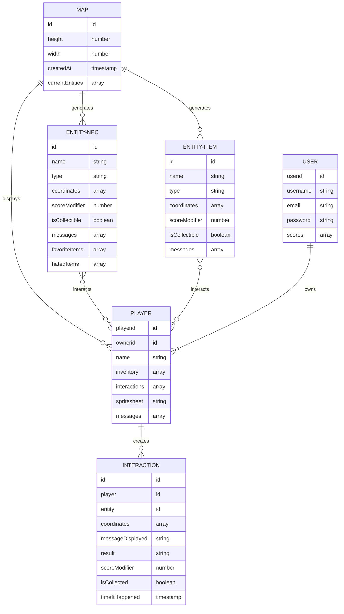

# Seides! A Cohort Thing.

## Links
[Capsone Project](https://git.generalassemb.ly/ga-wdi-boston/capstone-project)
📋 [Requirements](https://git.generalassemb.ly/ga-wdi-boston/capstone-project/blob/main/requirements.md)
📅 [Recommended Schedule](https://git.generalassemb.ly/ga-wdi-boston/capstone-project/blob/main/schedule.md)

## 💡 Ideas
  - RPG or platformer side-scroller with parallax backgrounds game?
  - At random intervals, random items have a chance to spawn on the map
  - When a player gets near an element (NPCs, trash cans, items), play interact animation (not idle animation) to show the item that is selected. The player can then hit the spacebar to interact with the element (pick up item, open )
  - Gifting items to NPCs increases your reputation level. A higher reputation level increases the chances NPCs will give you gifts)
  - NPCs have gift preferences. If they get a gift that they like, the player's reputation increases more than if they got a gift they are neutral about, if they get a gift they dislike, the player's reputation decreases.
  - In the inventory menu, move items with react-draggable?
  - Choose a player, start game, collect nodes on our Full stack developer road map? Maybe interactions throughout? 'networking'?

## 📝 User Stories
##### 🔒 Authentication
  - A new users can sign-up with an email and password,
  - A returning user can sign-in with their email and password,
  - A signed in user can choose to sign-out and end their game
  - A signed in user can go into their settings and and change their user password
##### 🚶 Movement
  - Players can start a new game that draws the map of the world with the static NPCs and interactable items
  - Players can use the <kbd>W</kbd> <kbd>A</kbd> <kbd>S</kbd> <kbd>D</kbd> or arrow keys to move their character sprite around the map
  - When a player is within a certain radius of an entity they can interact with, it outlines itself in white to allow it to stand out from the background
  - If the Player walks over a collectible item, they can pick it up and add it to their inventory
  - Picking up an item increases your score based on the item's'quality?
  - Players can view all the items they collect in their inventory
  - Players can view each item individually with more details
  - Players can interact with a dumpster or trash can to throw away items from their inventory
##### Entities
  - Players can chat/interact with NPCs
  - Interactions with NPCs are recorded in your diary
  - Players can give items from their inventory to NPCs
  - NPCs can occasionally gift random items to players
  - NPCs can respond to a player's interaction with a random message from a list of possible response messages (or a public API?)

### Engine
Large background image that can scroll from side to side based on

### Routes

Front-end routes - handled by React and React-Router

#### Authentication Routes
| Endpoint         | Component | `AuthenticatedRoute`? |
|------------------|-------------------|-------|
| `/sign-up`       | `SignUp`    | No |
| `/sign-in`       | `SignIn`    | No |
| `/change-password` | `ChangePassword`  | Yes |
| `/sign-out`        | `SignOut`   | Yes |

## Features
### `<AuthenticatedRoute />`

This template contains a handy component for creating routes that require a user to be authenticated before visiting. This component lives in `src/auth/components/AuthenticatedRoute.js` and is already required in `App`. It's a thin wrapper around React Router's `<Route />` component. The only difference is that it expects a prop called `user`, and if that prop is falsy, it will render a `<Redirect />` that takes the user to `/`. **To use it, you must pass it the user as a prop!**

It supports both the `component=` and `render=` attributes, but like `<Route />` it will not forward props to the component if you use `component=`.

### `<AutoDismissAlert />` Component

This template also already contains a component that displays user messages. Messages are configurable via redux actions.  This component can be found in `src/components/AutoDismissAlert/AutoDismissAlert.js`. **There is no need to add this component to your app. It is already required in `App`.**  A single component instance is used to manage all alerts application-wide.

The alert can be used by passing the `alertMsg` method to a rendered route.  The `alertMsg` method expects an object with a `heading`, `message`, and a `variant` property.

Use this component in conjunction with the `messages.js` file in the same directory to create and manage all of your application messages in one place.

 To change the duration of the message, replace `5000` with a value of your choice (in milliseconds) in this component's `componentDidMount` method.

## Public APIs
[Joke API](https://sv443.net/jokeapi/v2/)
[Yo Momma Jokes API](https://yomomma-api.herokuapp.com/jokes)
[Dad Joke API](https://icanhazdadjoke.com/api)

[`react-bootstrap`](https://react-bootstrap.github.io/)

## ER Diagram

